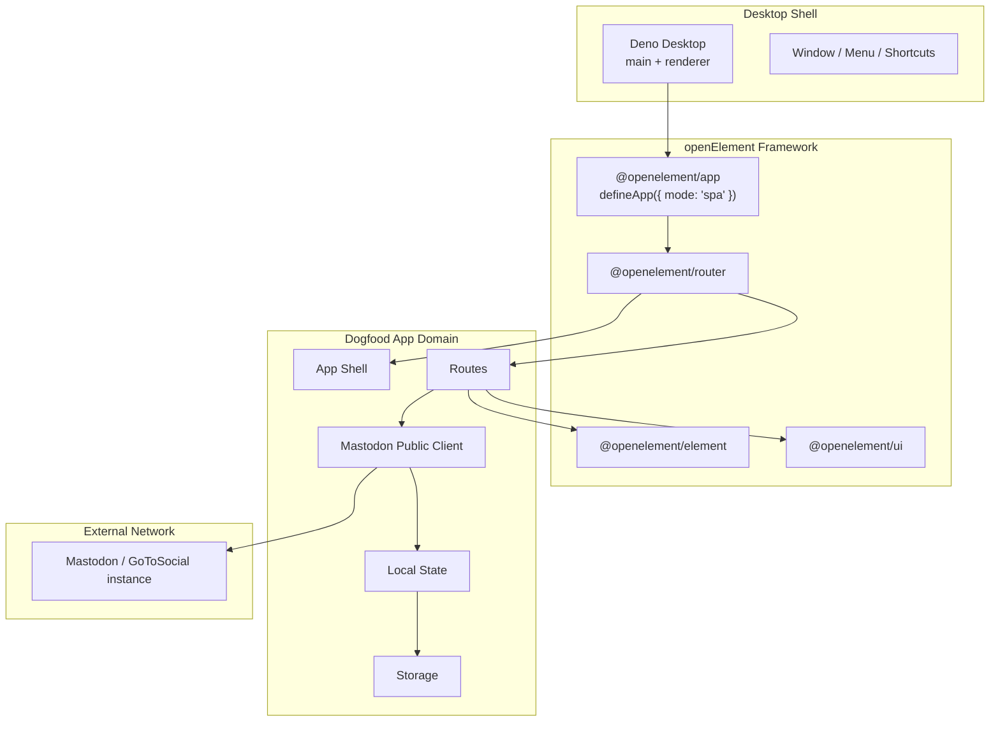
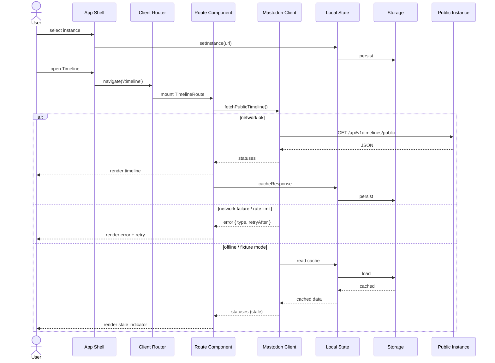

# Mastodon Desktop Dogfood

> **Framework surface under test**: SPA mode, Deno Desktop, networked public APIs, third-party Web Components interop, local state/cache, error boundaries, render pipeline under dynamic content.\
> **Target release**: v0.41.0-alpha.7

## Positioning

This is a **read-only / accountless networked desktop dogfood app**, not a social client product. Its job is to use real public network I/O as a stress source to expose gaps in the current openElement framework surface.

Reader already proved local-first documents and desktop ergonomics. Mastodon Desktop proves remote public API fetching, timeline-style navigation, cache/error/rate-limit states, and networked desktop UX.

## Non-Goals

- No OAuth / login / session flow.
- No direct messages, notifications, streaming, or background sync.
- No compose, reply, favorite, boost, follow, or any authenticated mutation.
- No encrypted credential storage.
- No server / data / forms / session / cache framework primitives (v0.42+ scope).

## Architecture



## Module Responsibilities

| Module          | Location                                 | Responsibility                                                           |
| --------------- | ---------------------------------------- | ------------------------------------------------------------------------ |
| Desktop entry   | `examples/deno-desktop-mastodon/main.ts` | Deno Desktop main process: create window, load renderer, system menu.    |
| Renderer entry  | `examples/deno-desktop-mastodon/app.ts`  | Boot openElement SPA.                                                    |
| App shell       | `app/shell.tsx`                          | Three-panel layout: instance sidebar, content panel, detail panel.       |
| Routes          | `app/routes/`                            | `index`, `timeline`, `profile`, `status`, `settings`.                    |
| Mastodon client | `app/lib/mastodon-client.ts`             | Public API calls, fetch wrapping, errors, rate limits, fixture fallback. |
| Local state     | `app/lib/state.ts`                       | Selected instance, saved statuses/accounts, lightweight cache.           |
| Storage adapter | `app/lib/storage.ts`                     | `localStorage` / `IndexedDB` abstraction with memory fallback for tests. |
| Components      | `app/components/`                        | Status card, avatar, media gallery, instance picker, error state.        |
| Fixtures        | `app/fixtures/`                          | Deterministic timeline/profile/status JSON.                              |

## Data Flow



## Framework Stress-Test Mapping

| Dogfood scenario                           | Framework surface under test                      | Problems we want to expose                                 |
| ------------------------------------------ | ------------------------------------------------- | ---------------------------------------------------------- |
| Boot desktop shell and load SPA            | `defineApp({ mode: 'spa' })`, bootstrap           | `file://` routing, asset paths, boot failures              |
| Leave timeline open for 30+ minutes        | SPA lifecycle, disposal, effect cleanup           | Memory leaks, event accumulation                           |
| Rapidly switch timeline / profile / status | Client router, async route data, error boundaries | Race conditions, stale data, error state overlap           |
| Render 100+ status cards                   | Render pipeline, island upgrades, signal tracking | Jank, slow hydration, high CPU                             |
| Use Shoelace/Material components in shell  | Third-party WC interop                            | Event bubbling, slot issues, theme leakage                 |
| Network failure / rate limit               | App-level error handling boundaries               | Error boundaries, re-render storms, loading states         |
| Offline boot reading cache                 | Local state persistence abstraction               | Storage incompatibility, route inconsistency after restore |
| Multiple windows                           | Deno Desktop multi-window, state isolation        | Storage conflicts, broadcast needs                         |
| Build and package desktop app              | adapter-vite, SSG build                           | Bundle size, asset paths, notarization                     |
| Install and run from npm                   | npm consumer experience                           | Import maps, types, dependency resolution                  |

## Proposed File Layout

```text
examples/deno-desktop-mastodon/
├── deno.json
├── main.ts
├── app.ts
├── index.html
├── vite.config.ts
├── app/
│   ├── shell.tsx
│   ├── routes/
│   │   ├── index.tsx
│   │   ├── timeline.tsx
│   │   ├── profile.tsx
│   │   ├── status.tsx
│   │   └── settings.tsx
│   ├── components/
│   │   ├── status-card.tsx
│   │   ├── avatar.tsx
│   │   ├── media-gallery.tsx
│   │   ├── instance-picker.tsx
│   │   └── error-state.tsx
│   ├── lib/
│   │   ├── mastodon-client.ts
│   │   ├── state.ts
│   │   ├── storage.ts
│   │   └── fixtures.ts
│   └── fixtures/
│       ├── timeline.json
│       ├── profile.json
│       └── status.json
├── e2e/
│   └── mastodon-smoke.spec.ts
└── README.md
```

## Acceptance Criteria

- [ ] Desktop app boots with instance selector + timeline + profile + status routes.
- [ ] Core flow runs from deterministic fixtures without network.
- [ ] Live-network opt-in can read any public Mastodon/GoToSocial instance timeline.
- [ ] Network errors, rate limits, and invalid instance URLs have explicit UI states.
- [ ] Saved statuses/accounts restore after app restart.
- [ ] Third-party WC (at least Shoelace) interacts stably inside the shell.
- [ ] Browser + Deno Desktop smoke covers boot, navigation, and fixture flow.
- [ ] 30+ minute runtime does not show obvious memory growth or UI freeze.
- [ ] Docs clearly state this is a framework dogfood, not a production social client.

## Parent Tracking

- Parent PRD: #57
- Concrete slices: #195 through #201, plus #221 for third-party WC event interaction smoke.
