# openElement × Linear.app Design System

> **Version**: 1.0.0
> **Date**: 2026-06-16
> **Designer**: AI Design Agent
> **Reference**: linear.app
> **Platform**: openElement Web Components (DSD-first)
> **Font**: Inter (Google Fonts) / JetBrains Mono (Google Fonts)

---

## Quick Navigation

| Section       | Path                           | Description                                            |
| ------------- | ------------------------------ | ------------------------------------------------------ |
| Design Tokens | [`tokens/`](./tokens/)         | Colors, typography, spacing, radii — W3C + CSS formats |
| Components    | [`components/`](./components/) | Button, Card, Input, Nav, Badge, Icon specs            |
| Icons         | [`icons/`](./icons/)           | 6 feature icons (SVG, 24×24 viewBox)                   |
| Mockups       | [`mockups/`](./mockups/)       | High-fidelity page mockups (PNG + SVG)                 |
| Layout Specs  | [`specs/`](./specs/)           | Homepage, docs, design-system page specs               |
| Handoff       | [`handoff/`](./handoff/)       | Migration guide & QA checklist                         |

---

## Design Philosophy

1. **Canvas 即留白** — 深色背景本身就是留白，不用白色间隙
2. **Surface 阶梯** — 4 层表面（canvas → surface-1 → surface-2 → surface-3）构建层级
3. **Hairline 分隔** — 极细边框（1px, rgba(255,255,255,0.06)）替代阴影
4. **顶部边缘高光** — 卡片顶部 1px 微弱白边，制造"像素渲染"感
5. **无渐变、无阴影、无氛围光** — 零装饰性渐变，零 drop-shadow
6. **产品截图即主角** — 每个 section 以产品 UI 截图为核心视觉元素
7. **Typography 即品牌** — 激进的负字间距 + 精确的 weight 阶梯
8. **单色强调** — 只用 Indigo/Lavender 一个强调色
9. **紧凑按钮** — 8px 圆角，8px 14px padding，不是 pill

---

## Color Palette

### Dark Mode（唯一营销主题）

| Token                 | Hex                      | Usage                        |
| --------------------- | ------------------------ | ---------------------------- |
| `--bg-canvas`         | `#08080a`                | Page background              |
| `--surface-1`         | `#0d0f12`                | Nav, secondary panels        |
| `--surface-2`         | `#16191d`                | Cards, code blocks           |
| `--surface-3`         | `#212529`                | Elevated elements, dropdowns |
| `--color-brand`       | `#4263eb`                | Primary CTA, links, accent   |
| `--color-brand-hover` | `#3b5bdb`                | Button hover                 |
| `--color-brand-light` | `#5c7cfa`                | Focus ring                   |
| `--text-primary`      | `#e9ecef`                | Headlines, body              |
| `--text-secondary`    | `#adb5bd`                | Subtitles, descriptions      |
| `--text-muted`        | `#868e96`                | Captions, meta               |
| `--border`            | `rgba(255,255,255,0.06)` | Hairline borders             |
| `--border-hover`      | `rgba(255,255,255,0.10)` | Hover borders                |
| `--edge-highlight`    | `rgba(255,255,255,0.08)` | Card top edge                |

### Light Mode（仅产品 UI 预览）

| Token                 | Hex                      | Usage              |
| --------------------- | ------------------------ | ------------------ |
| `--bg-canvas`         | `#f8f9fa`                | Page background    |
| `--surface-1`         | `#ffffff`                | Panels             |
| `--surface-2`         | `#f1f3f5`                | Cards              |
| `--surface-3`         | `#e9ecef`                | Elevated elements  |
| `--color-brand`       | `#4263eb`                | Primary CTA, links |
| `--color-brand-hover` | `#3b5bdb`                | Button hover       |
| `--color-brand-light` | `#5c7cfa`                | Focus ring         |
| `--text-primary`      | `#12131a`                | Headlines          |
| `--text-secondary`    | `#626676`                | Subtitles          |
| `--text-muted`        | `#8e92a2`                | Captions, meta     |
| `--border`            | `rgba(18,19,26,0.08)`    | Hairline borders   |
| `--border-hover`      | `rgba(18,19,26,0.12)`    | Hover borders      |
| `--edge-highlight`    | `rgba(255,255,255,0.50)` | Card top edge      |

---

## Typography Scale

| Token      | Size | Weight | Line-Height | Letter-Spacing | Usage                |
| ---------- | ---- | ------ | ----------- | -------------- | -------------------- |
| Display XL | 80px | 600    | 0.95        | -0.04em        | Hero headline        |
| Display LG | 56px | 600    | 1.05        | -0.03em        | Section opener       |
| Display MD | 40px | 600    | 1.05        | -0.02em        | Sub-section headline |
| Headline   | 28px | 600    | 1.20        | -0.01em        | Pricing, CTA banner  |
| Card Title | 22px | 500    | 1.25        | -0.005em       | Feature card title   |
| Subhead    | 20px | 400    | 1.40        | -0.01em        | Lead paragraphs      |
| Body LG    | 18px | 400    | 1.50        | 0              | Hero subhead         |
| Body       | 16px | 400    | 1.50        | 0              | Default body         |
| Body SM    | 14px | 400    | 1.50        | 0              | Card body, footer    |
| Caption    | 12px | 400    | 1.40        | 0              | Captions, meta       |
| Button     | 14px | 500    | 1.20        | 0              | Button labels        |
| Eyebrow    | 13px | 500    | 1.30        | +0.04em        | Section labels       |
| Mono       | 13px | 400    | 1.50        | 0              | Code snippets        |

> **Note**: Linear 在 Display 上只用 600，从不用 700+。这是其"克制的力量"的关键。

---

## Spacing Scale

| Token     | Value | Usage                       |
| --------- | ----- | --------------------------- |
| `xxs`     | 4px   | Micro gaps                  |
| `xs`      | 8px   | Button padding-y, icon gaps |
| `sm`      | 12px  | Button gap, card gap        |
| `md`      | 16px  | Standard gap, card gap      |
| `lg`      | 24px  | Card padding, section gap   |
| `xl`      | 32px  | Page padding-x              |
| `xxl`     | 48px  | Large spacing               |
| `section` | 96px  | Section separation          |

---

## Border Radius Scale

| Token  | Value  | Usage                       |
| ------ | ------ | --------------------------- |
| `xs`   | 4px    | Small chips, badges         |
| `sm`   | 6px    | Inline tags                 |
| `md`   | 8px    | Buttons, inputs, tabs       |
| `lg`   | 12px   | Cards, feature cards        |
| `xl`   | 16px   | Product panels, code blocks |
| `pill` | 9999px | Status badges, tabs         |

---

## Breakpoints

| Name    | Width      | Layout Changes                              |
| ------- | ---------- | ------------------------------------------- |
| Desktop | ≥ 1024px   | 3-column feature grid, hero side-by-side    |
| Tablet  | 768–1023px | 2-column feature grid, hero stacked         |
| Mobile  | < 768px    | 1-column, simplified nav, code panel hidden |

---

## Files & Deliverables

### Mockups

| #  | Page              | Preview                                        | SVG                                     | PNG                                     |
| -- | ----------------- | ---------------------------------------------- | --------------------------------------- | --------------------------------------- |
| 01 | Homepage Hero     | 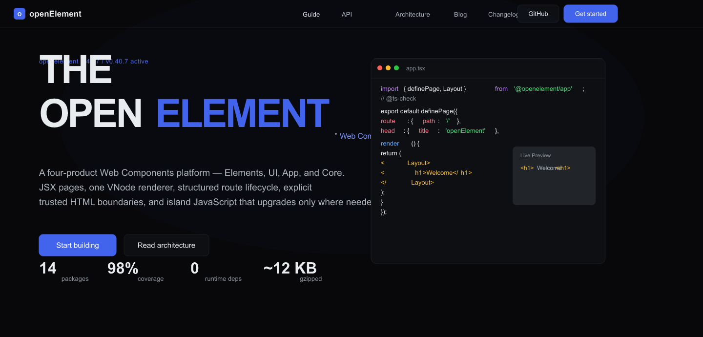          | [SVG](mockups/01-homepage-hero.svg)     | [PNG](mockups/01-homepage-hero.png)     |
| 02 | Features Grid     | 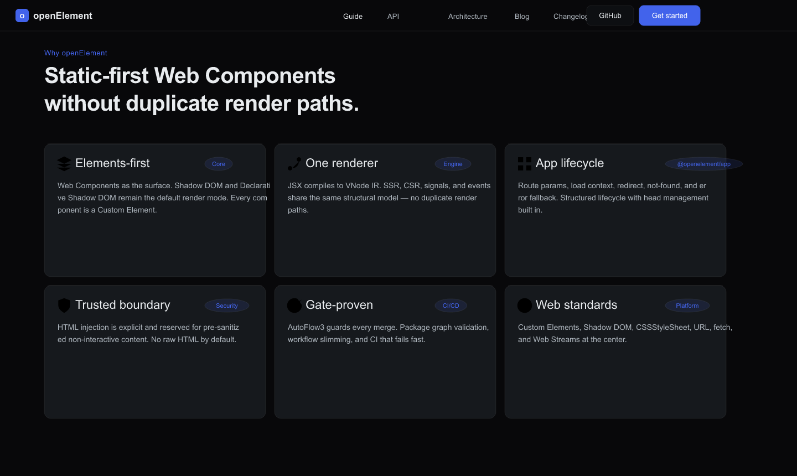  | [SVG](mockups/02-homepage-features.svg) | [PNG](mockups/02-homepage-features.png) |
| 03 | Full Homepage     | 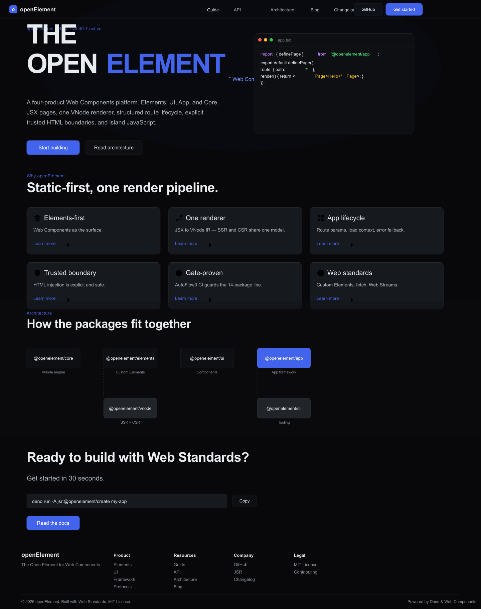  | [SVG](mockups/03-homepage-fullpage.svg) | [PNG](mockups/03-homepage-fullpage.png) |
| 04 | Docs Landing      | 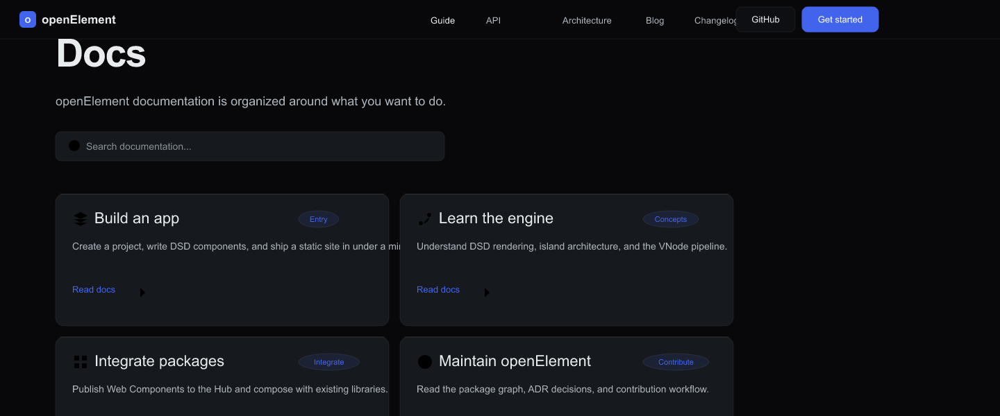           | [SVG](mockups/04-docs-landing.svg)      | [PNG](mockups/04-docs-landing.png)      |
| 05 | Design System     | 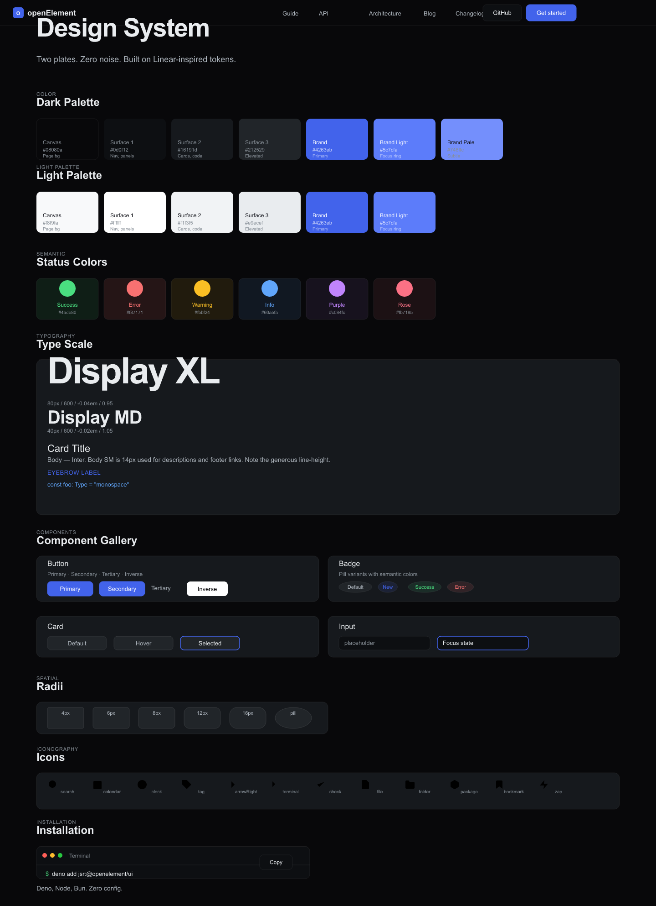 | [SVG](mockups/05-design-system.svg)     | [PNG](mockups/05-design-system.png)     |
| 06 | Guide Page        | 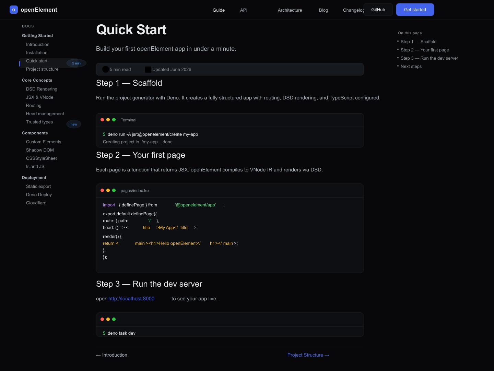            | [SVG](mockups/06-guide-page.svg)        | [PNG](mockups/06-guide-page.png)        |
| 07 | Architecture Page | 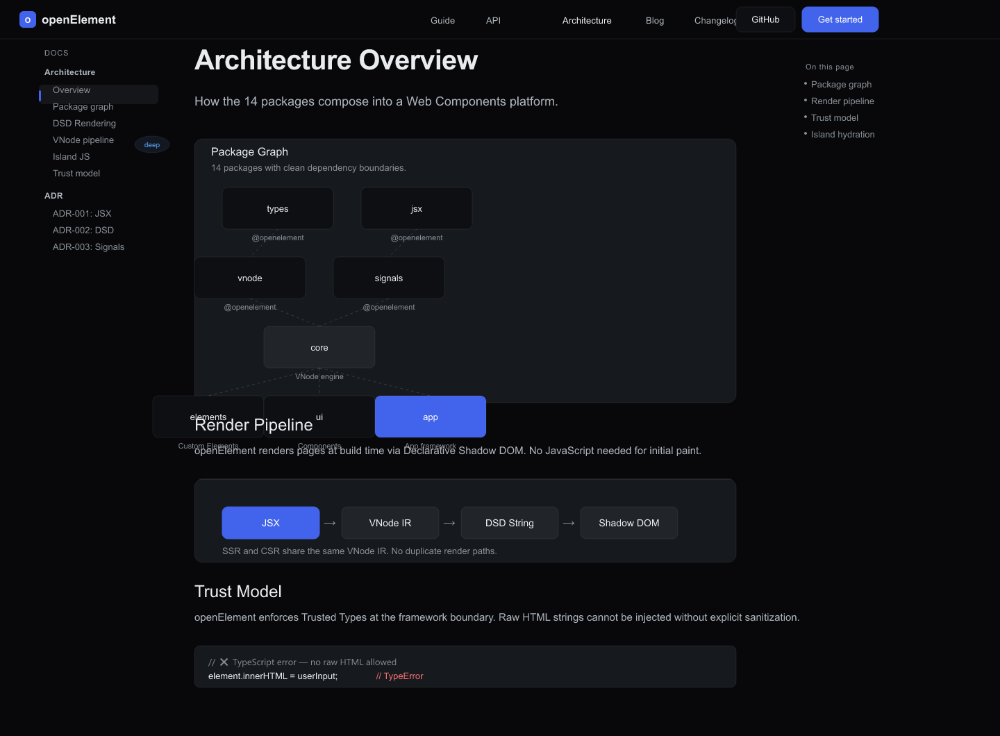      | [SVG](mockups/07-architecture-page.svg) | [PNG](mockups/07-architecture-page.png) |
| 08 | Blog Index        | 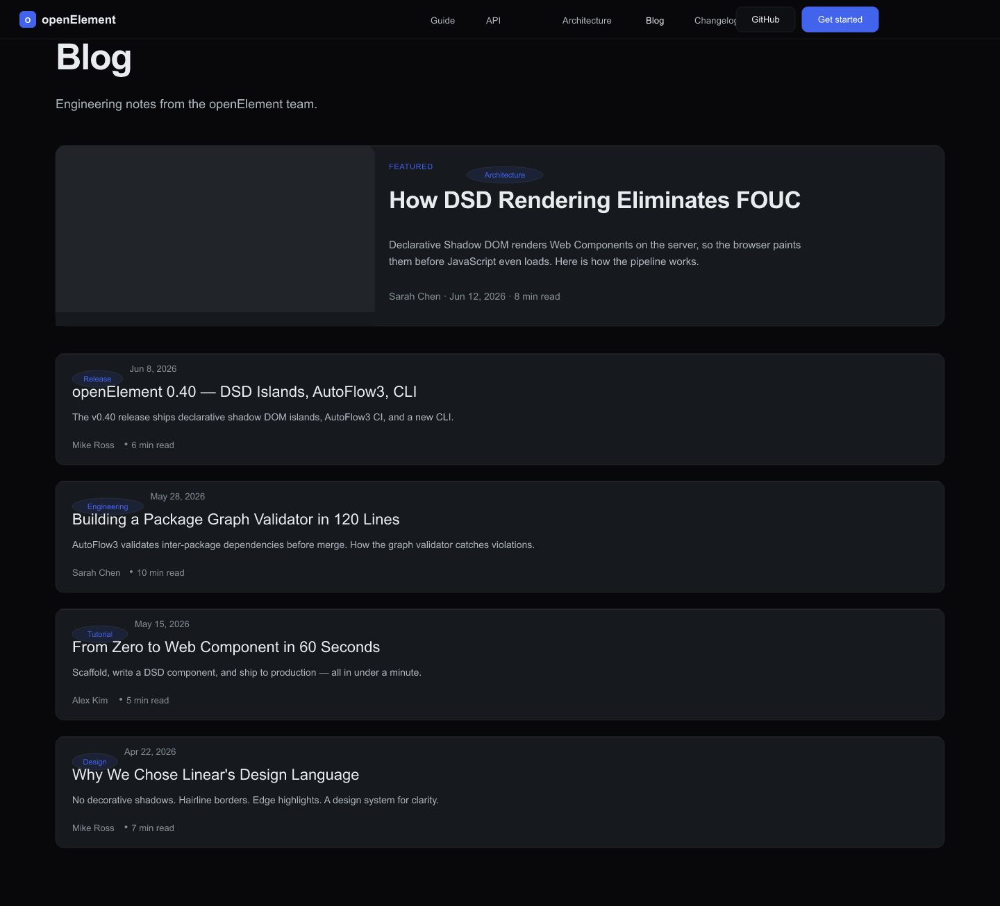             | [SVG](mockups/08-blog-index.svg)        | [PNG](mockups/08-blog-index.png)        |
| 09 | Blog Post         | 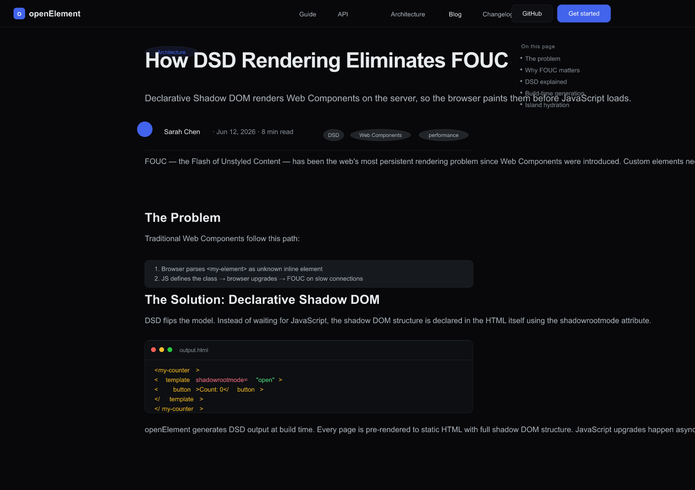              | [SVG](mockups/09-blog-post.svg)         | [PNG](mockups/09-blog-post.png)         |
| 10 | Changelog         | 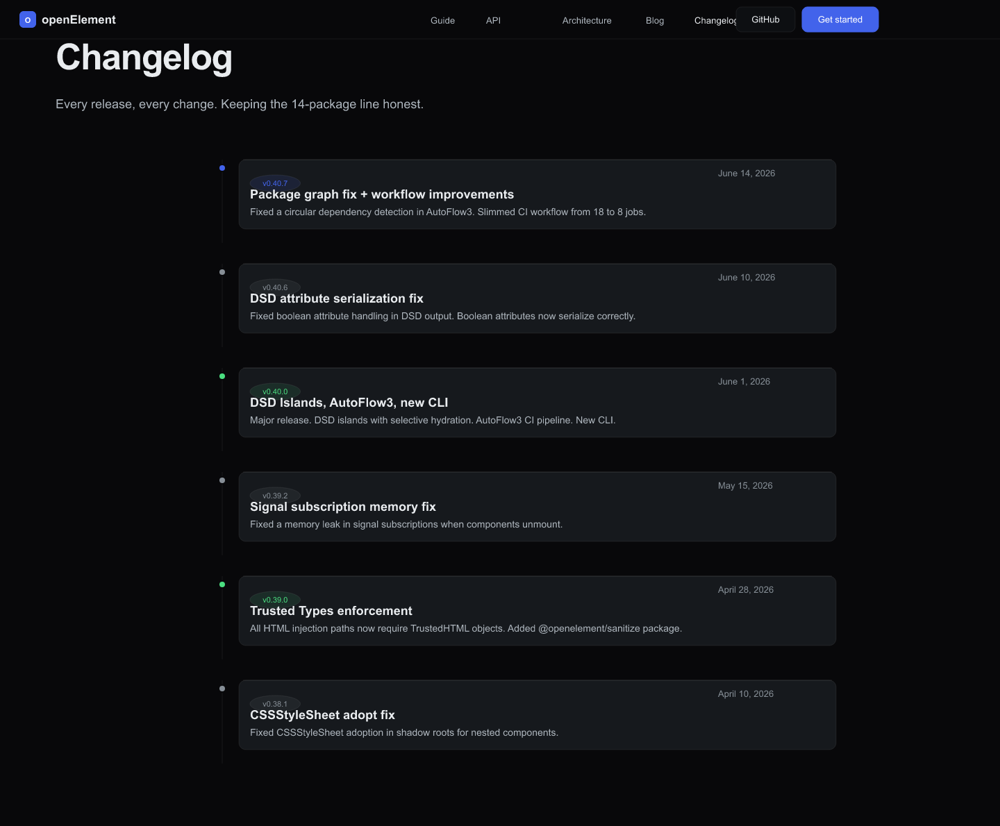         | [SVG](mockups/10-changelog.svg)         | [PNG](mockups/10-changelog.png)         |
| 11 | Contributing      | 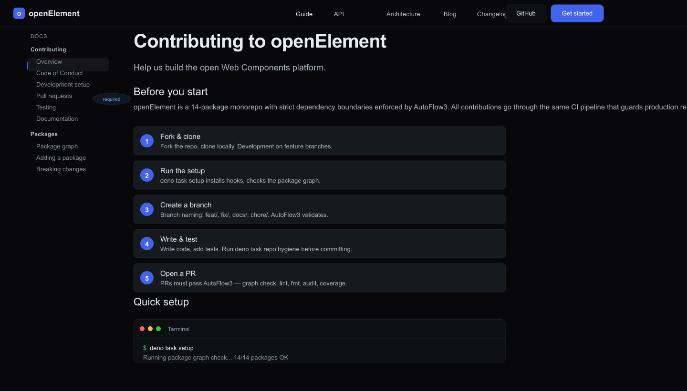        | [SVG](mockups/11-contributing.svg)      | [PNG](mockups/11-contributing.png)      |
| 12 | Roadmap           | 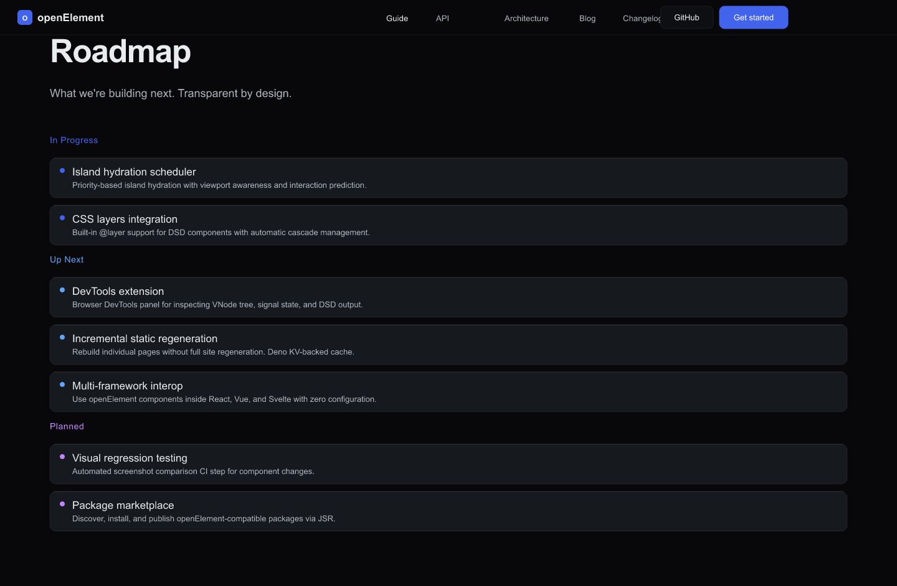             | [SVG](mockups/12-roadmap.svg)           | [PNG](mockups/12-roadmap.png)           |
| 13 | API List          | 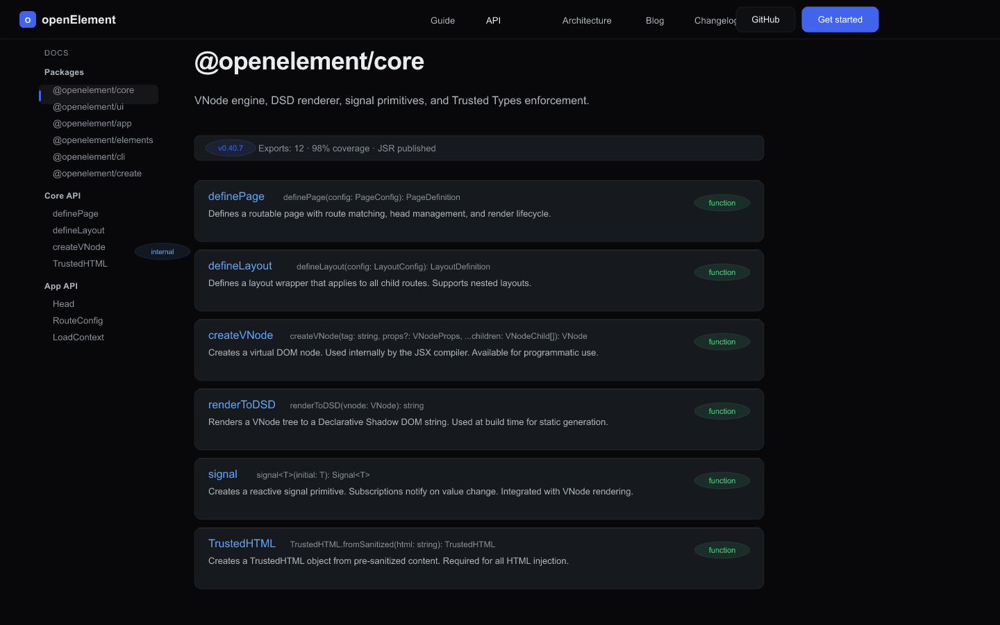                | [SVG](mockups/13-api-list.svg)          | [PNG](mockups/13-api-list.png)          |
| 14 | 404 Page          | 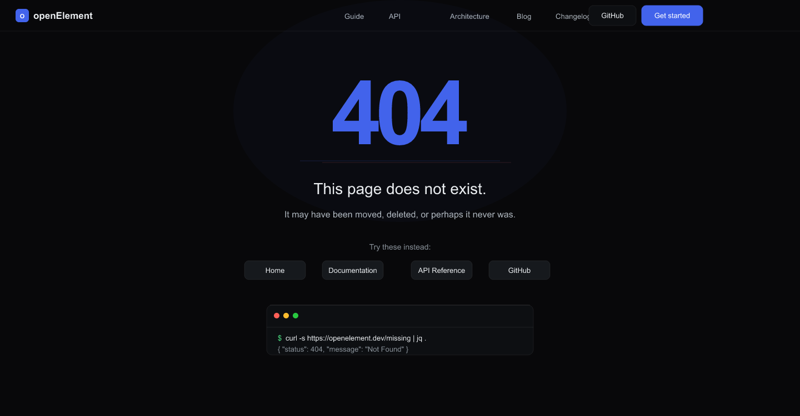               | [SVG](mockups/14-not-found.svg)         | [PNG](mockups/14-not-found.png)         |

> **Dimensions**: All mockups at 1440px wide. Height varies by page type (690–1820px).
>
> **Source**: Generated from `mockups/generate.mjs` using `tokens/tokens.json` and `icons/` icon library. All design values sourced from token definitions.

### Tokens

- `tokens/tokens.json` — W3C Design Tokens format
- `tokens/tokens.css` — CSS Custom Properties
- `tokens/tokens.md` — Token documentation

### Components

- `components/button.md` — 4 variants (primary, secondary, tertiary, inverse)
- `components/card.md` — Top edge highlight, hover states
- `components/input.md` — Focus ring, hairline border
- `components/nav.md` — Sticky nav, backdrop blur, 56px height
- `components/badge.md` — Pill status badge
- `components/icon.md` — 16×16 / 24×24 / 32×32 sizes

### Icons (23 icons, 24×24 viewBox)

| Feature Icons          | General Icons                                         |
| ---------------------- | ----------------------------------------------------- |
| `elements-first.svg`   | `search.svg`, `calendar.svg`, `clock.svg`, `tag.svg`  |
| `one-renderer.svg`     | `arrow-right.svg`, `external-link.svg`, `github.svg`  |
| `app-lifecycle.svg`    | `terminal.svg`, `check.svg`, `file.svg`, `folder.svg` |
| `trusted-boundary.svg` | `chevron-right.svg`, `copy.svg`, `package.svg`        |
| `gate-proven.svg`      | `zap.svg`, `layers.svg`, `bookmark.svg`               |
| `web-standards.svg`    |                                                       |

All icons use `stroke="currentColor"` for CSS-driven color theming.

---

## Version History

| Version | Date       | Changes                           |
| ------- | ---------- | --------------------------------- |
| 1.0.0   | 2026-06-16 | Initial Linear.app style redesign |

---

## Contact

- **Framework**: [openelement.org](https://openelement.org)
- **GitHub**: [github.com/open-element/openelement](https://github.com/open-element/openelement)
